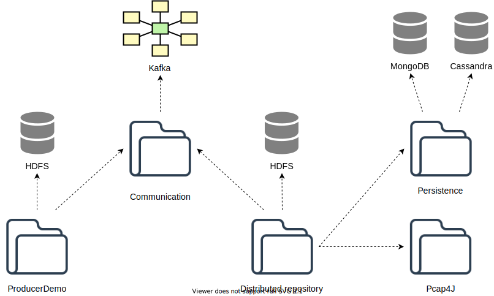

# Distributed Forensic Digital Data Repository: Technical Documentation

(c) 2018-2020 Marek Rychly (rychly@fit.vutbr.cz) and Martin Josefik (xjosef00@stud.fit.vutbr.cz)

## Architecture

The system consists of several modules that are listed below.

The distributed repository is storing data in a distributed filesystem based on HDFS,
while metadata (e.g., indices) are stored in distributed databases MongoDB and Cassandra.
MongoDB is utilized to store a structured data required by the distributed storage itself,
while Cassandra is used to store metadata and extracted data required by clients
(i.e., data and their indices).

To extract the data and obtain their metadata, the system utilizes Pcap4J library.

As a communication platform between the distributed repository and its clients,
Kafka message broker is employed.

## Implementation

A client can connect to the distributed repository via Kafka message queue.
After the connection, the client can control the repository by commands sent via the message queue.
The list of commands is available in the [User Guide](./user-guide.md).

## Acknowledgements

*This work was supported by the Ministry of the Interior of the Czech Republic as a part of the project Integrated platform for analysis of digital data from security incidents VI20172020062.*
